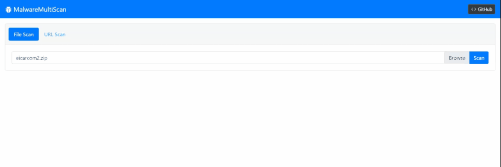

# MalwareMultiScan

    

Self-hosted [VirusTotal](https://www.virustotal.com/) / [OPSWAT MetaDefender](https://metadefender.opswat.com/) wannabe API for scanning URLs and files by multiple antivirus solutions.



**IMPORTANT**: version 1.5 introduces breaking changes in containers configuration and docker-compose.yaml layout. Please see [releases](https://github.com/mindcollapse/MalwareMultiScan/releases) page and changelog of [docker-compose.yaml](https://github.com/mindcollapse/MalwareMultiScan/commits/master/docker-compose.yaml) and [README.md](https://github.com/mindcollapse/MalwareMultiScan/commits/master/README.md) for the additional details. 

## Introduction

I faced a need to scan user-uploaded files in one of my work projects in an automated mode to ensure they don't contain any malware. Using VirusTotal was not an option because of a) legal restrictions and data residency limitations b) scanning by hash-sums would not be sufficient because the majority of files are generated / modified by users. 

After googling, I stumbled upon a fantastic [maliceio/malice](https://github.com/maliceio/malice) project. Unfortunately, it [looks abandoned](https://github.com/maliceio/malice/issues/100#issuecomment-529246119), and most plugins do not work for the moment. In addition to that, I had an intention to use the .NET stack to align with the internal infrastructure.

In the end, it's nothing but the set of Docker containers running the agent. That agent downloads the remote file to the temp folder, then launches the vendor command-line scanning utility with proper arguments, and parses the output with a regular expression to extract a detected malware name.

## Installation & Usage

**IMPORTANT**: MalwareMultiScan is not intended as a publicly-facing API / UI. It has (intentionally) no authorization, authentication, rate-limiting, or logging. Therefore, it should be used only as an internal / private API or behind the restrictive API gateway.

Whole solution can be started with `docker-compose up` executed in a root folder of repository.

It can be also deployed to the Docker Swarm cluster by using the command `docker stack deploy malware-multi-scan --compose-file docker-compose.yaml`.

After the start the Demo Web UI will become available under http://localhost:8888.

See [components](#components) chapter below and the [docker-compose.yaml](docker-compose.yaml) file.

### Configuration

Configuration of API and Scanners is performed by passing the environment variables. Descriptions and default values are provided below.

#### MalwareMultiScan.Api

* `MONGO_ADDRESS=mongodb://localhost:27017` - MongoDB connection string.

* `MONGO_DATABASE=MalwareMultiScan` - MongoDB collection name.

* `REDIS_ADDRESS=localhost:6379` - Redis address for the distributed task queue.

* `CONSUL_ADDRESS=http://localhost:8500` - Consul address for the service registration.

* `FILE_SIZE_LIMIT=52428800` - Maximum size of a file that can be handled for the file scanning. The size of the URL content is not verified. Set to 0 to disable the validation.

#### MalwareMultiScan.Scanner

* `BACKEND_ID=dummy` - Id of a backend.

* `REDIS_ADDRESS=localhost:6379` - Redis address for the distributed task queue.

* `CONSUL_ADDRESS=http://localhost:8500` - Consul address for the service registration.

* `MAX_SCANNING_TIME=60` - Scan time limit. It is used not just for actual scanning but also for getting the file.

* `WORKER_COUNT=4` - Number of workers for parallel scanning.

#### MalwareMultiScan.Ui

* `API_URL=http://localhost:5000` - Absolute URL incl. port number for the running instance of MalwareMultiScan.Api.  

### API Endpoints

* POST `/api/queue/url` with a `url` parameter passed via the form data.. Returns `201 Accepted` response with a [ScanResult](MalwareMultiScan.Api/Data/ScanResult.cs) or `400 Bad Request` error.

* POST `/api/queue/file` with a `file` parameter passed via the form data. Returns `201 Accepted` response with a [ScanResult](MalwareMultiScan.Api/Data/ScanResult.cs) or `400 Bad Request` error.

* GET `/api/results/{result-id}` where `{result-id}` corresponds to the id value of a [ScanResult](MalwareMultiScan.Api/Data/ScanResult.cs). Returns `200 OK` response with a [ScanResult](MalwareMultiScan.Api/Data/ScanResult.cs) or `404 Not Found` error.

#### Callback URL

Both `/api/queue/url` and `/api/queue/file` also accept an optional `callbackUrl` parameter with the http(s) URL in it. This URL will be requested by the POST method with JSON serialized [ScanResultMessage](MalwareMultiScan.Shared/Message/ScanResultMessage.cs) in a body on every update from scan backends. Query string will contain `id` parameter that corresponds to the id of the scan result and `backend` parameter with the id of backend which completed the scan.

I.e. when you define `callbackUrl=http://localhost:1234/scan-results`, the POST request will be made to `http://localhost:1234/scan-results?id=123&backend=dummy` with a body

```json
{
  "Status": 1,
  "Duration": 5,
  "Threats": ["Malware.Dummy.Result"]
}
```

## Supported Scan Engines

| Name | Dockerfile | Enabled | Comments |
|------|------------|---------|----------|
| [ClamAV](https://www.clamav.net/) | [Clamav.Dockerfile](MalwareMultiScan.Backends/Dockerfiles/Clamav.Dockerfile) | :white_check_mark: | |
| [Comodo](https://www.comodo.com/home/internet-security/antivirus-for-linux.php) | [Comodo.Dockerfile](MalwareMultiScan.Backends/Dockerfiles/Comodo.Dockerfile) | :white_large_square: | |
| [DrWeb](https://download.drweb.com/linux/?lng=en) | [DrWeb.Dockerfile](MalwareMultiScan.Backends/Dockerfiles/DrWeb.Dockerfile) | :white_large_square: | Pass license key to the DRWEB_KEY build arg. |
| Dummy | [Dockerfile](MalwareMultiScan.Scanner/Dockerfile) | :white_check_mark: | Scan backend made for testing. Returns Malware.Dummy.Result threat for every scan after 5 seconds. |
| [KES](https://support.kaspersky.com/kes10linux) | [KES.Dockerfile](MalwareMultiScan.Backends/Dockerfiles/KES.Dockerfile) | :white_large_square: | Pass license key to the KES_KEY build arg. KES 11 does not work in Docker. |
| [McAfee](https://www.mcafee.com/enterprise/en-us/products/virusscan-enterprise-for-linux.html) | [McAfee.Dockerfile](MalwareMultiScan.Backends/Dockerfiles/McAfee.Dockerfile) | :white_large_square: | |
| [Sophos](https://www.sophos.com/en-us/support/documentation/sophos-anti-virus-for-linux.aspx) | [Sophos.Dockerfile](MalwareMultiScan.Backends/Dockerfiles/Sophos.Dockerfile) | :white_large_square: | |
| [Defender](https://github.com/taviso/loadlibrary#windows-defender) | [WindowsDefender.Dockerfile](MalwareMultiScan.Backends/Dockerfiles/WindowsDefender.Dockerfile) | :white_check_mark: | |

More scan backends can be added in the future. Some of the popular ones do not have command line scanning utility, Linux version, or don't start in Docker container. Feel free to raise an issue if you know any in addition to the list above.

## Components

### Workflow

1. On startup all [Scanners](MalwareMultiScan.Scanner) register themselves in [Consul](https://www.consul.io/) with a service name equal to `scanner` and the `BackendId` metadata field equal to the value of `BACKEND_ID` environment variable. They also register a TTL check and listen for [Hangfire](https://www.hangfire.io/) background job in a queue named under the `BackendId` metadata field.

2. Third-party client triggers `/api/queue/url` or `/api/queue/file` of the [MalwareMultiScan.Api](MalwareMultiScan.Api).

3. [MalwareMultiScan.Api](MalwareMultiScan.Api) sends a query to [Consul](https://www.consul.io/) and receives the list of alive scan backends with the service name `scanner`.

4. [MalwareMultiScan.Api](MalwareMultiScan.Api) schedules a [Hangfire](https://www.hangfire.io/) background job in a queue named under the `BackendId` metadata field.

5. [Scanners](MalwareMultiScan.Scanner) picks up a job from queue, starts the scan and sends result back to the `default` queue of [Hangfire](https://www.hangfire.io/).

6. [MalwareMultiScan.Api](MalwareMultiScan.Api) picks a job from the default` queue of [Hangfire](https://www.hangfire.io/) and updates the state of the scan.

7. If callback URL was specified during the step #2, [MalwareMultiScan.Api](MalwareMultiScan.Api) triggers a HTTP POST request to the specified URL. See [Callback URL](#callback-url) for details.

### Prerequisites

* **MongoDB** of version 3.x or above. Used for storing scan results and files in GridFS. The communication is happening through the [official C#/.NET driver](https://docs.mongodb.com/drivers/csharp).

* **Redis** of version 5.x or above. Used for tasks queueing. The communication is happening through the [Hangfire](https://www.hangfire.io/) library.

* **Consul** of version 1.8.x or above. Used for service registration of scan backends. 

* **Docker** and **docker-compose** running under Windows (in Linux containers mode), Linux, or OSX. Docker Compose is needed only for test / local deployments.

* **Optional**: DockerSwarm / Kubernetes cluster for scaling up the scanning capacities.

### Parts

* [MalwareMultiScan.Api](MalwareMultiScan.Api) - Simple ASP.NET Core WebApi for queueing files & urls for the scan and returning the result. Also acts as a receiver of scan results from the scanning backend nodes. See [Dockerfile](MalwareMultiScan.Api/Dockerfile).

* [MalwareMultiScan.Backends](MalwareMultiScan.Backends) - Scan backends logic. Includes Dockerfiles and implementation classes for third-party vendor scan backends.

* [MalwareMultiScan.Shared](MalwareMultiScan.Shared) - Shared components.

* [MalwareMultiScan.Scanner](MalwareMultiScan.Scanner) - .NET Core Worker service subscribes to messages corresponding to the backend id, then fires up scanning command-line utility, and parses the output. See [Dockerfile](MalwareMultiScan.Scanner/Dockerfile). The image of MalwareMultiScan.Scanner acts as a base image for the rest of the scan backends. Check Dockerfiles from the [table above](#supported-scan-engines) for details.

* [MalwareMultiScan.Ui](MalwareMultiScan.Ui) - Nuxt.js TypeScript SPA for demoing the API capabilities. See [Dockerfile](MalwareMultiScan.Ui/Dockerfile). 
 
 ## Plans
 
 See [issues](https://github.com/mindcollapse/MalwareMultiScan/issues) for the list of planned features, bug-fixes, and improvements.
